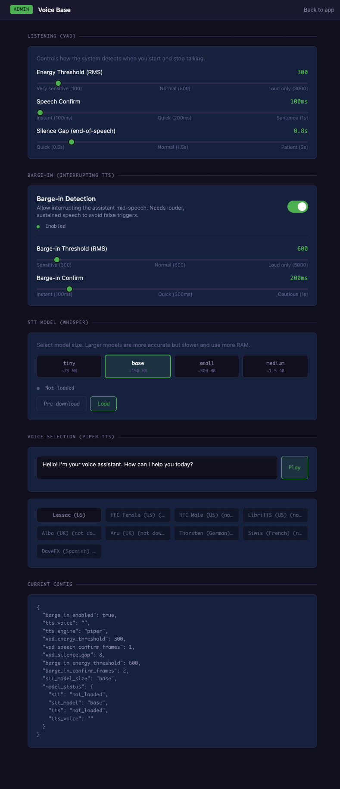

# Voice Base — Browser-to-Server Voice UI

A minimal, self-contained voice conversation system that connects your browser microphone to Claude via WebRTC. Everything runs locally (STT + TTS) except the LLM call.

**Browser mic → WebRTC → VAD → STT (Whisper) → Claude → TTS (Piper) → Browser speaker**

No FSM, no workflows — just real-time voice conversation with an AI assistant.


## Features

- **Real-time WebRTC audio** — low-latency browser ↔ server audio via `aiortc`
- **Local STT** — faster-whisper (tiny/base/small/medium) runs on CPU, no cloud API needed
- **Local TTS** — Piper ONNX voices, auto-downloaded from HuggingFace on first use
- **Barge-in** — interrupt the assistant mid-speech; configurable energy threshold
- **Admin panel** — tune VAD, barge-in, switch STT models, preview voices — all live, no restart
- **Sentence-level streaming** — TTS plays first sentence while later ones are still synthesizing
- **Markdown cleanup** — strips `**bold**`, bullet lists, URLs etc. before speaking

## Prerequisites

- **Python 3.11+**
- **An Anthropic API key** ([get one here](https://console.anthropic.com/))
- ~200 MB disk for the default Whisper `base` model + Piper voice

## Quick Start

```bash
# 1. Clone
git clone https://github.com/davidbmar/voice-only-UI-STT-TTS-base.git
cd voice-only-UI-STT-TTS-base

# 2. Virtual environment
python -m venv .venv
source .venv/bin/activate

# 3. Install dependencies
pip install -r requirements.txt

# 4. Configure
cp .env.example .env
# Edit .env and set your ANTHROPIC_API_KEY

# 5. Run
python server.py
# or: uvicorn server:app --port 8080
```

Open **http://localhost:8080** → click **Call** → speak → see transcript + hear response.

## Admin Panel

Visit **http://localhost:8080/admin** to configure the voice pipeline at runtime:



| Section | What it controls |
|---------|-----------------|
| **Listening (VAD)** | Energy threshold, speech confirm frames, silence gap before end-of-speech |
| **Barge-in** | Toggle + energy threshold/confirm tuning for interrupting TTS playback |
| **STT Model** | Switch Whisper model size (tiny → medium), pre-download models |
| **Voice Selection** | Browse Piper voices, download on click, preview with text-to-speech |
| **Live Config** | Real-time JSON view of all runtime settings |

All changes take effect immediately — no server restart needed.

## Configuration

### Environment Variables

| Variable | Required | Description |
|----------|----------|-------------|
| `ANTHROPIC_API_KEY` | Yes | Your Anthropic API key |
| `TWILIO_ACCOUNT_SID` | No | Twilio SID for TURN server credentials (NAT traversal) |
| `TWILIO_AUTH_TOKEN` | No | Twilio auth token (paired with SID above) |

Without Twilio credentials, the app uses Google's public STUN server. This works on most networks but may fail behind strict corporate firewalls.

### Runtime Settings (via Admin Panel or API)

| Setting | Default | Description |
|---------|---------|-------------|
| `vad_energy_threshold` | 300 | RMS energy level to detect speech |
| `vad_speech_confirm_frames` | 1 | Consecutive frames above threshold before speech is confirmed |
| `vad_silence_gap` | 8 | Consecutive silent frames before end-of-speech (×100ms) |
| `barge_in_enabled` | true | Allow interrupting TTS playback |
| `barge_in_energy_threshold` | 600 | RMS threshold for barge-in (higher than VAD to avoid false triggers) |
| `barge_in_confirm_frames` | 2 | Consecutive loud frames before interrupting |
| `stt_model_size` | base | Whisper model: tiny (~75MB), base (~150MB), small (~500MB), medium (~1.5GB) |
| `tts_voice` | en_US-lessac-medium | Piper voice ID |

## API Endpoints

| Endpoint | Method | Purpose |
|----------|--------|---------|
| `/` | GET | Voice call UI |
| `/admin` | GET | Admin panel |
| `/ws` | WS | WebSocket signaling (WebRTC + voice loop) |
| `/api/config` | GET | Current runtime settings + model status |
| `/api/config` | POST | Update whitelisted config keys |
| `/api/voices` | GET | Piper voice list with download status |
| `/api/tts/preview` | POST | Synthesize text → WAV audio blob |
| `/api/tts/download` | POST | Pre-download a Piper voice |
| `/api/stt/status` | GET | STT model load state |
| `/api/stt/switch` | POST | Switch STT model size |
| `/api/stt/download` | POST | Pre-download a Whisper model |

## Architecture

```
Browser                          Server
───────                          ──────
getUserMedia()                   FastAPI + uvicorn
    │                                │
    ├─ WebRTC offer ──── /ws ───────►│
    │                                ├─ aiortc PeerConnection
    │◄── WebRTC answer ─────────────┤
    │                                │
    ├─ Audio frames (Opus) ────────►│─► VAD (energy-based)
    │                                │      │
    │                                │      ├─ Speech detected
    │                                │      │     │
    │                                │      │     ▼
    │                                │   faster-whisper STT
    │                                │      │
    │                                │      ▼
    │  {"type":"transcript"} ◄──────│   Claude API
    │                                │      │
    │                                │      ▼
    │  Audio frames (Opus) ◄────────│   Piper TTS → AudioQueue → WebRTC track
    │  {"type":"response"}  ◄──────│
    │                                │
    ▼                                │
  <audio> element plays             Barge-in detection runs during playback
```

## Project Structure

```
├── server.py                    # FastAPI app + API endpoints
├── config.py                    # Settings (.env), runtime_settings, model_status
├── requirements.txt
├── .env.example
│
├── engine/
│   ├── stt.py                   # faster-whisper STT (transcribe, model switching)
│   ├── tts.py                   # Piper TTS (synthesize, voice catalog, download)
│   ├── adapter.py               # Sine wave generator (test/fallback)
│   └── types.py                 # AudioChunk, VoiceInfo dataclasses
│
├── gateway/
│   ├── server.py                # WebSocket signaling + VAD voice loop
│   ├── webrtc.py                # WebRTC Session (PeerConnection, mic capture, TTS playback)
│   ├── turn.py                  # Twilio TURN credential fetcher
│   └── audio/
│       ├── audio_queue.py       # Thread-safe FIFO for TTS output
│       ├── webrtc_audio_source.py  # Custom aiortc MediaStreamTrack
│       └── pcm_ring_buffer.py   # Fixed-size ring buffer (unused, kept for reference)
│
└── web/
    ├── index.html               # Voice call UI
    └── admin.html               # Admin panel
```

## How It Works

1. **Connection** — Browser opens WebSocket to `/ws`, receives ICE servers, establishes WebRTC peer connection
2. **Greeting** — Server speaks a greeting via TTS while the mic starts capturing
3. **Listening** — Energy-based VAD detects speech start/stop in 100ms polling intervals
4. **Transcription** — Accumulated PCM audio is sent to faster-whisper (resampled 48kHz → 16kHz)
5. **LLM** — Transcribed text + conversation history sent to Claude (Sonnet); response is 1-2 sentences
6. **Speech** — Response text is cleaned (markdown stripped), split into sentences, synthesized sentence-by-sentence via Piper, and streamed through an AudioQueue to the WebRTC track
7. **Barge-in** — During TTS playback, mic audio is monitored; if energy exceeds the barge-in threshold for enough consecutive frames, playback stops and the new speech is processed

## Available Voices

The default voice catalog includes English (US + UK), German, French, and Spanish voices from the [Piper project](https://github.com/rhasspy/piper). Voices are downloaded automatically from HuggingFace on first use (~15-50MB each).

## Troubleshooting

| Problem | Solution |
|---------|----------|
| `aiortc` won't install | Requires `libsrtp2-dev` on Linux: `apt install libsrtp2-dev` |
| No audio from assistant | Check browser console for autoplay policy; click the page first |
| WebRTC fails to connect | Try adding Twilio TURN credentials in `.env` |
| STT is slow | Switch to `tiny` model in Admin panel; or use a machine with more RAM |
| TTS sounds robotic | Try different Piper voices in the Admin panel |

## License

MIT
